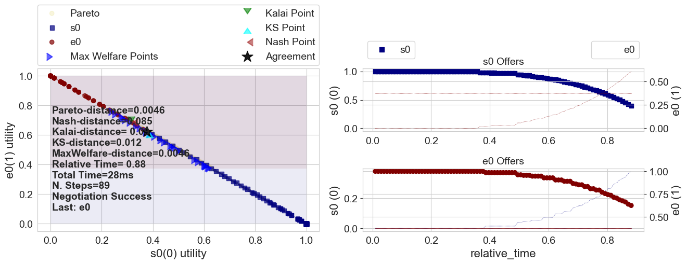
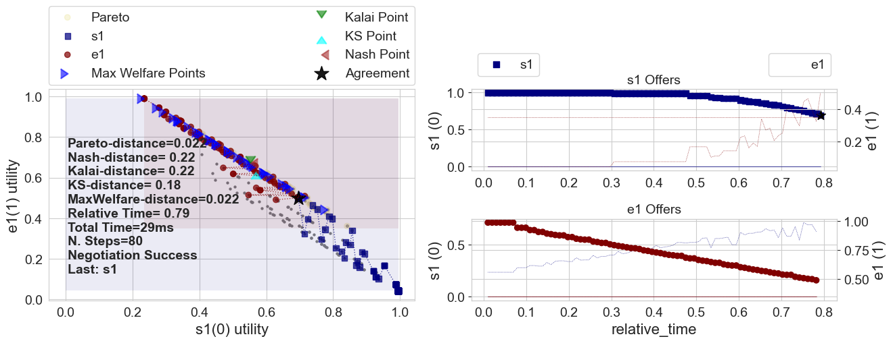
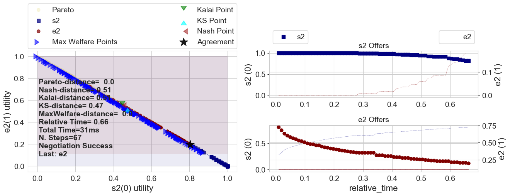
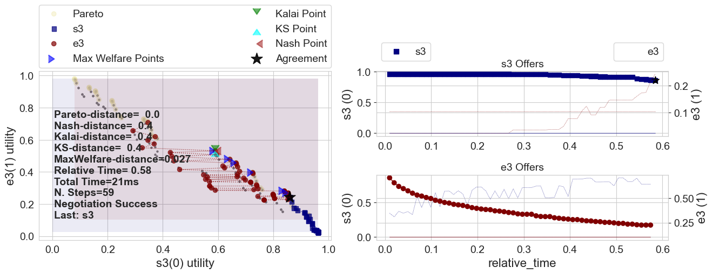
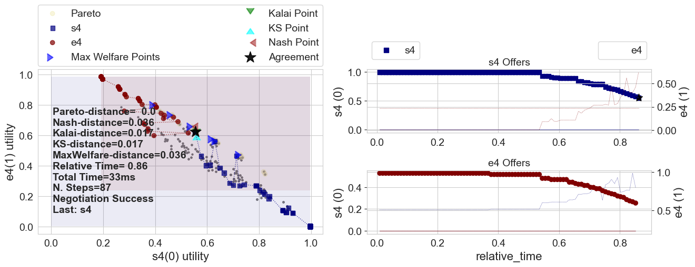
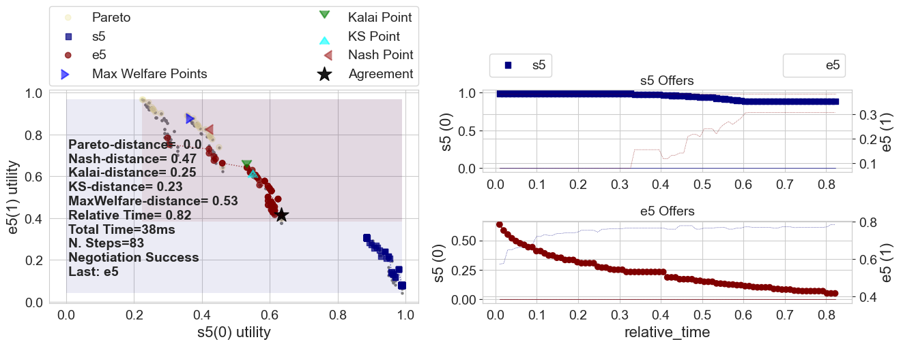
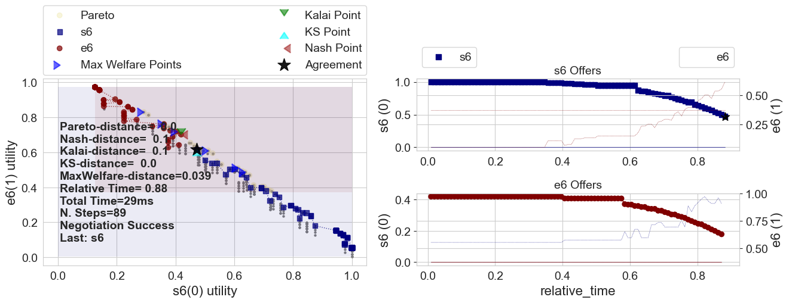
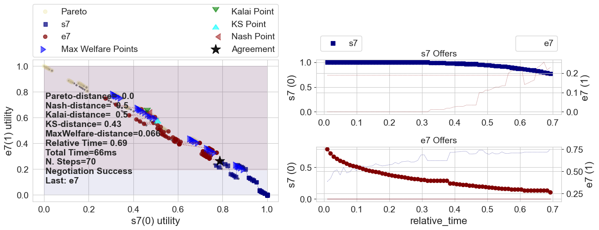

## Running a Multi-deal negotiation

ANL 2025's challenge is to develop agents capable of negotiating sequentially a set of interrelated deals (Multi-deal negotiation). You can create and run a multi-deal negotiation using special tools provided by the anl2025 package. (2)

### A random multideal-session


```python
from anl2025 import make_multideal_scenario

scenario = make_multideal_scenario(nedges=8)
```

**What just happened?**

We created a random multi-deal session with one center agent and 8 edge agents. The center agent negotiates with all the edge agents. Each one of these negotiations is called a **negotiation thread** and the whole set is called a **multi-deal negotiation**.

The following figure shows the structure of a typical such scenario (with 8 edge agents). Each one of the **edge agents** has its own utility function $e_i$.

The **center agent** faces a different challenge. It has one utility function defined for each **negotiation thread** called a **side utility function** ($s_i$). The overall utility of the center agent is some function (called the **combination function**) of the side utilities it gets in all the negotiation threads.

```{note}
In ANL 2025, the center agent negotiates with the side agents sequentially. It completes a negotiation with one edge agent before starting the next negotiation with the next edge agent. At no time does the center agent have multiple negotiation threads running at the same time.
```

The following figure shows the situation:


The function `make_multideal_scenario` creates such a scenario. The combination function used by default is `max` (i.e. the center get the maximum utlility it gets in all negotiations) but you can easily change it. See the full documentation of `make_multideal_scenario` in the Reference for more details of how to control all aspects of scenario  generation.


The function `run_session` runs one multi-deal negotiation. Behind the scenes, a lot of things happen in this small function. The function `run_session` automatically outputs logs of each thread, specifying what bid happened at what round. Moreover, it outputs a graph of the utilities of the center agent and the edge agents. By default, you can find this folder here **...\negmas\anl2025\session**.

Below, we show the outputted graphs. On the left, one can see the bids that were posed, with the utility of the center agent on the y-axis and the utility of the edge agent on the x-axis. The right figures show the bids over time, one for both agents.


```python
from anl2025 import run_session
results = run_session(scenario)

```


    

    


    

    


    

    


    

    


    

    


    

    


    

    


    

    


Like mentioned, a lot of things happen behind the scenes, with all default parameters. The default parameters are all in line with the criteria of ANL2025, so you can use this function to find your way in the competition. For example, look at the parameters that you can change yourself, such as the center agent, edge agents and maximum number of rounds (`nsteps`):


```python


centeragent = "Random2025"
edgeagents = [
        "Random2025",
         "Linear2025",
        "Conceder2025"]
if False: #this function will not run, remove this line if you want it to run.
        results = run_session(
                scenario=scenario,
                center_type=centeragent,
                edge_types=edgeagents,
                nsteps=10)
```

You can also ask for specific types of output, by looking into `results`, e.g.:


```python

print(f"Center utility: {results.center_utility}")
print(f"Edge Utilities: {results.edge_utilities}")
```


<pre style="white-space:pre;overflow-x:auto;line-height:normal;font-family:Menlo,'DejaVu Sans Mono',consolas,'Courier New',monospace">Center utility: <span style="color: #008080; text-decoration-color: #008080; font-weight: bold">0.8597682225581035</span>
</pre>


<pre style="white-space:pre;overflow-x:auto;line-height:normal;font-family:Menlo,'DejaVu Sans Mono',consolas,'Courier New',monospace">Edge Utilities: <span style="font-weight: bold">[</span><span style="color: #008080; text-decoration-color: #008080; font-weight: bold">0.6231814702215154</span>, <span style="color: #008080; text-decoration-color: #008080; font-weight: bold">0.5004659393834174</span>, <span style="color: #008080; text-decoration-color: #008080; font-weight: bold">0.19763095600241815</span>, <span style="color: #008080; text-decoration-color: #008080; font-weight: bold">0.2420100529169169</span>, 
<span style="color: #008080; text-decoration-color: #008080; font-weight: bold">0.6239709131183655</span>, <span style="color: #008080; text-decoration-color: #008080; font-weight: bold">0.41525772055401966</span>, <span style="color: #008080; text-decoration-color: #008080; font-weight: bold">0.61641875459796</span>, <span style="color: #008080; text-decoration-color: #008080; font-weight: bold">0.26278285441816085</span><span style="font-weight: bold">]</span>
</pre>


### A dinners' scheduling session

In the previous example, the center utility function was defined in terms of individual side utility functions (one per negotiation threads). A more general case is when the center utility function is defined directly in terms of the outcomes of negotiation threads without locally defined utility functions. The following figure shows an example of this kind of scenario:


The `anl2025` package allows you to create such scenarios using the `LambdaCenterUFun` class (See Reference). One class of these scenarios is the **Dinners** scenarios in which one person (center agent) is negotiating with her friends (edge agents) about the day to go out for dinner. Each friend has her own utility function for different days. The center agent has a utility for each combination of agreements (i.e. she may prefer to go out once every night except in Tuesdays,


```python
from anl2025 import make_dinners_scenario

results = run_session(make_dinners_scenario())
```


    

    


    

    


    

    


```python

```
[Download Notebook](/anl2025/tutorials/notebooks/Tutorial_run_a_negotiation.ipynb)
